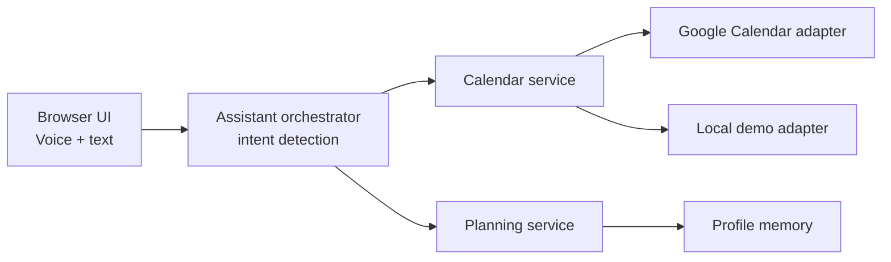

# Week Planner Agent

Week Planner Agent is a voice-first "calendar chief of staff" for `SC4052` Topic 2. It is structured as a Personal Assistant-as-a-Service platform with separate services for assistant orchestration, calendar access, planning logic, and user preferences.

## Features

- Voice in, voice out in the browser using the Web Speech API.
- Weekly briefing that summarizes the schedule and planning risks.
- Conflict, overload, and fragmented-day detection.
- Best-slot recommendation for study or deep work.
- Focus-time protection proposal.
- Real Google Calendar adapter path with a local demo-calendar fallback.

## Architecture



## REST Endpoints

- `POST /assistant/query`
- `GET /calendar/week-summary`
- `GET /calendar/source`
- `POST /calendar/events`
- `GET /auth/google/start`
- `GET /auth/google/callback`
- `POST /planner/suggest-slots`
- `POST /planner/protect-focus-time`

## Run

```bash
python3 app.py
```

Then open [http://127.0.0.1:8000](http://127.0.0.1:8000).

## Google Calendar Integration

The app uses the local demo adapter by default. End users can connect Google Calendar with a normal sign-in flow once the app owner configures Google OAuth once.

### One-time owner setup

1. In Google Cloud, enable the Google Calendar API.
2. Configure the OAuth consent screen.
3. Create an OAuth client for a web application.
4. Add `http://127.0.0.1:8000/auth/google/callback` to the authorized redirect URIs for local development.
5. Create `data/google_oauth_client.json` with this shape:

```json
{
  "client_id": "YOUR_GOOGLE_CLIENT_ID",
  "client_secret": "YOUR_GOOGLE_CLIENT_SECRET",
  "redirect_uri": "http://127.0.0.1:8000/auth/google/callback"
}
```

The file is ignored by git.

You can also provide the same values with environment variables:

```bash
export GOOGLE_OAUTH_CLIENT_ID="YOUR_GOOGLE_CLIENT_ID"
export GOOGLE_OAUTH_CLIENT_SECRET="YOUR_GOOGLE_CLIENT_SECRET"
export GOOGLE_OAUTH_REDIRECT_URI="http://127.0.0.1:8000/auth/google/callback"
python3 app.py
```

### End-user flow

1. Open the app.
2. Click `Connect Google Calendar`.
3. Sign in with Google and approve calendar access.
4. The assistant switches from the demo calendar to the user's real Google Calendar.

Prototype note: the current implementation stores the connected calendar only for the active browser session. A production multi-user deployment should move sessions and tokens into a real database-backed auth/session layer.

## Demo prompts

- `What matters this week?`
- `Add revision tomorrow at 3 pm for 2 hours`
- `Find the best slot this week for study for 2 hours`
- `Protect focus time for 2 hours`

## Tests

```bash
python3 -m unittest discover -s tests
```
