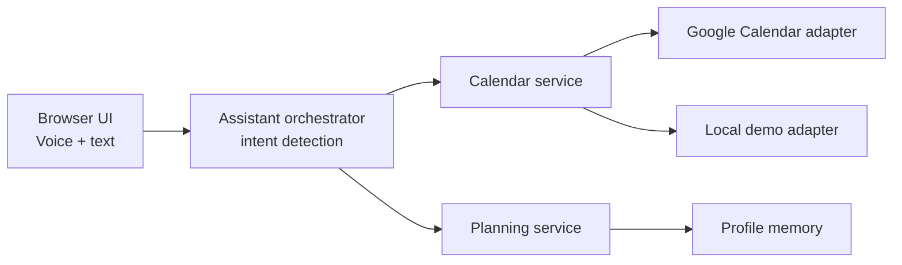

# Week Planner Agent

Week Planner Agent is a voice-first "calendar chief of staff" for `SC4052` Topic 2. It is structured as a Personal Assistant-as-a-Service platform with separate services for assistant orchestration, calendar access, planning logic, and user preferences.

## Features

- Voice in, voice out in the browser using the Web Speech API.
- Weekly briefing that summarizes the schedule and planning risks.
- Conflict, overload, and fragmented-day detection.
- Best-slot recommendation for study or deep work.
- Focus-time protection proposal.
- Real Google Calendar adapter path with a local demo-calendar fallback.

## Architecture



## REST Endpoints

- `POST /assistant/query`
- `GET /calendar/week-summary`
- `POST /calendar/events`
- `POST /planner/suggest-slots`
- `POST /planner/protect-focus-time`

## Run

```bash
python3 app.py
```

Then open [http://127.0.0.1:8000](http://127.0.0.1:8000).

## Google Calendar Integration

The app uses the local demo adapter by default. To switch to Google Calendar:

1. Create an OAuth access token for Google Calendar with access to `https://www.googleapis.com/auth/calendar`.
2. Export it into the environment before running the server:

```bash
export GOOGLE_CALENDAR_ACCESS_TOKEN="your-access-token"
export GOOGLE_CALENDAR_ID="primary"
python3 app.py
```

When the token is present, the `GoogleCalendarAdapter` is used for listing and creating events.

## Demo prompts

- `What matters this week?`
- `Add revision tomorrow at 3 pm for 2 hours`
- `Find the best slot this week for study for 2 hours`
- `Protect focus time for 2 hours`

## Tests

```bash
python3 -m unittest discover -s tests
```
